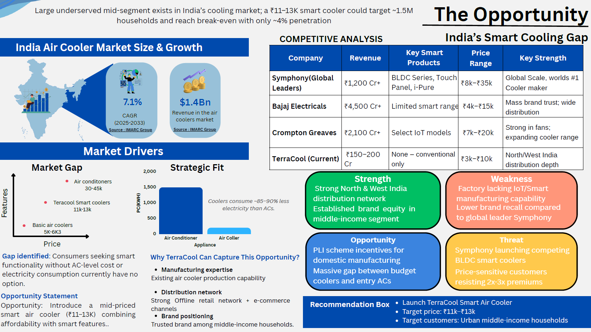
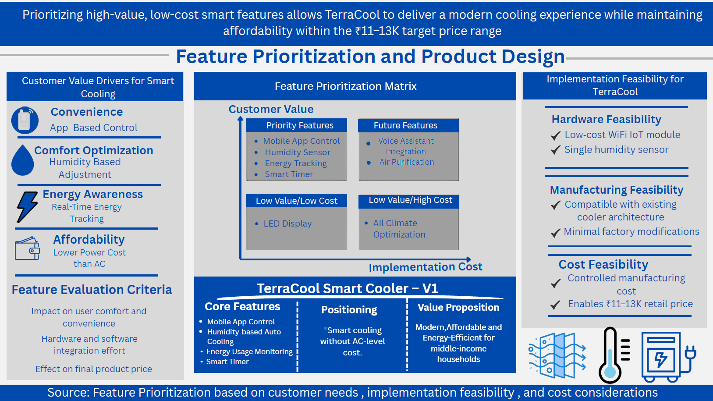

# TerraCool Smart Air Cooler – Product Strategy

> Designed a mid-market smart cooling solution by identifying a gap between low-cost coolers and high-cost air conditioners.

# TerraCool Smart Air Cooler – Product Strategy

> Designed a mid-market smart cooling solution by identifying a gap between low-cost coolers and high-cost air conditioners.

---

## 🚨 Problem
Consumers lack an affordable smart cooling solution between basic air coolers (~₹5–6K) and expensive air conditioners (~₹30–45K).

---

## 🔍 Key Insights
- Large underserved mid-segment in Indian cooling market
- Smart features unavailable in ₹10–15K range
- Target market size ~1.5M households
- Coolers consume ~85–90% less electricity than ACs

---

## 💡 Solution
Proposed a **smart air cooler priced at ₹11–13K** with:
- Mobile app control
- Humidity-based auto cooling
- Energy usage tracking
- Smart timer

---

## ⚙️ Approach
- Conducted market and competitor analysis
- Identified pricing gap and target segment
- Prioritized features based on value vs implementation cost
- Designed product to minimize manufacturing changes

---

## 📈 Impact
- Break-even achievable at ~60,000 units
- Only ~4% market penetration required
- Strong positioning for middle-income urban households

---

## 🧠 Product Thinking
Focused on balancing **affordability vs smart functionality** by prioritizing high-value, low-cost features, ensuring scalability without significant manufacturing overhaul.

---

## 📎 Case Study
[terracool-case-study.pdf](./terracool-case-study.pdf)
